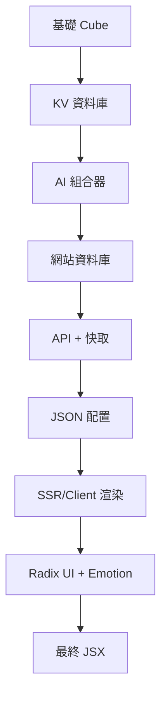

# AI 元件架構規劃書 v2.0

## 📋 專案概述

本文檔描述 WebCube2027 從傳統靜態元件系統遷移到 **Cube 元件系統 + AI 驅動的動態元件系統** 的完整技術架構規劃。

## 🎯 核心目標

### 主要目標
- � **Cube 元件系統** - 建立統一的基礎元件庫
- 🤖 **AI 組合生成** - AI 使用基礎 Cube 組合複雜佈局
- 🛡️ **系統穩定性** - 確保 AI 錯誤不會導致系統崩潰
- 🌈 **主題一致性** - 所有元件符合設計系統
- ⚡ **開發效率** - 提供流暢的開發和除錯體驗

### 技術挑戰
- ❌ **UnoCSS 靜態限制** - 無法支援動態生成的 class 名稱
- ❌ **AI 錯誤風險** - 語法錯誤可能導致 500 錯誤
- ❌ **主題系統** - 動態元件需要支援主題切換
- ❌ **除錯困難** - AI 生成錯誤難以定位

## 🏗️ 新技術架構

### 技術棧
```
🧊 Cube 元件系統    → 基礎元件庫 (Layout, Container, Card, Navigation)
🌈 CSS Variables     → 主題系統 + AI 調值機制
🎨 Emotion           → CSS-in-JS（動態樣式 + 動畫）
🤖 AI 組合器         → 基礎 Cube 智能組合
� KV 資料庫         → 基礎 Cube 儲存
🗄️ 網站資料庫       → AI 生成的佈局儲存
🚀 API + 快取        → JSON 佈局回傳
🔄 SSR/Client        → JSON → Radix UI + Emotion 渲染
```

### 架構流程


## 🧊 Cube 元件系統設計

### 基礎 Cube 分類
```typescript
// 佈局類 Cube
const LayoutCubes = {
  LayoutCube: '基礎佈局方塊',
  ContainerCube: '容器方塊', 
  GridCube: '網格佈局方塊'
}

// 內容類 Cube
const ContentCubes = {
  CardCube: '卡片方塊',
  TextCube: '文字方塊',
  ImageCube: '圖片方塊'
}

// 導航類 Cube
const NavigationCubes = {
  NavigationCube: '導航方塊',
  BreadcrumbCube: '麵包屑方塊'
}

// 互動類 Cube
const InteractiveCubes = {
  ButtonCube: '按鈕方塊',
  InputCube: '輸入框方塊',
  SelectCube: '選擇方塊'
}
```

### Cube 統一介面
```typescript
interface CubeProps {
  variant?: string        // 變體
  size?: string          // 尺寸
  color?: string         // 顏色主題
  spacing?: string       // 間距
  children?: ReactNode
  className?: string
  style?: CSSProperties
}

// 所有 Cube 都遵循相同的使用模式
<Cube variant="elevated" size="lg" color="primary">
  {children}
</Cube>
```

## 🌈 CSS Variables + Emotion 系統

### 設計系統結構
```typescript
// 完整的設計系統變數
export const DesignSystem = {
  // 顏色系統 (AI 可調值)
  colors: {
    primary: ['#3b82f6', '#2563eb', '#1d4ed8', '#1e40af'],
    secondary: ['#6b7280', '#4b5563', '#374151', '#1f2937'],
    accent: ['#10b981', '#059669', '#047857', '#065f46'],
    semantic: ['#ef4444', '#f59e0b', '#3b82f6', '#10b981']
  },
  
  // 間距系統 (AI 可調值)
  spacing: {
    xs: '0.25rem', sm: '0.5rem', md: '1rem', lg: '1.5rem', 
    xl: '2rem', '2xl': '3rem', '3xl': '4rem'
  },
  
  // 動畫系統 (AI 可調值)
  animations: {
    duration: ['0.15s', '0.3s', '0.5s', '0.8s'],
    easing: ['ease', 'ease-in', 'ease-out', 'ease-in-out'],
    keyframes: ['fadeIn', 'slideUp', 'scaleIn', 'bounce']
  }
}
```

### Emotion 整合
```typescript
// Cube 元件中的 Emotion 使用
export function CardCube({ variant = 'default', children }) {
  const cardStyles = css`
    background-color: var(--b1);
    border: 1px solid var(--b3);
    border-radius: var(--radius-box);
    padding: var(--spacing-lg);
    
    /* 使用 CSS Variables 控制動畫 */
    animation: var(--animation-fade-in);
    
    /* 條件性樣式 */
    ${variant === 'elevated' && css`
      box-shadow: var(--shadow-md);
    `}
    
    /* 懸停效果 */
    &:hover {
      animation: var(--animation-bounce);
      transform: translateY(-2px);
    }
  `
  
  return <div css={cardStyles}>{children}</div>
}
```

## 🤖 AI 組合系統

### AI 工作流程
```typescript
// AI 組合流程
export class AICubeComposer {
  static async composeLayout(request: LayoutRequest): Promise<LayoutConfig> {
    try {
      // 1. 取得可用 Cube
      const availableCubes = await this.getAvailableCubes()
      
      // 2. AI 分析需求
      const analysis = await this.analyzeRequest(request, availableCubes)
      
      // 3. AI 組合 Cube
      const composition = await this.composeCubes(analysis)
      
      // 4. 驗證組合
      const validation = await this.validateComposition(composition)
      
      // 5. 儲存到網站資料庫
      await this.saveToWebsiteDB(composition)
      
      return composition
    } catch (error) {
      throw new Error(`AI 組合失敗: ${error.message}`)
    }
  }
}
```

### AI 可用資源
```typescript
// AI 可用的基礎資源
const AvailableAIResources = {
  cubes: {
    layout: ['LayoutCube', 'ContainerCube', 'GridCube'],
    content: ['CardCube', 'TextCube', 'ImageCube'],
    navigation: ['NavigationCube', 'BreadcrumbCube'],
    interactive: ['ButtonCube', 'InputCube', 'SelectCube']
  },
  
  css_variables: {
    colors: ['--p', '--s', '--a', '--b1', '--b2', '--b3'],
    spacing: ['--spacing-xs', '--spacing-sm', '--spacing-md', '--spacing-lg'],
    typography: ['--text-sm', '--text-base', '--text-lg', '--text-xl'],
    animations: ['--animation-fast', '--animation-normal', '--animation-slow']
  },
  
  emotion_patterns: {
    layout: ['display: flex', 'justify-content: center', 'align-items: center'],
    visual: ['background-color: var(--color)', 'border-radius: var(--radius)'],
    spacing: ['padding: var(--spacing)', 'margin: var(--spacing)', 'gap: var(--spacing)']
  }
}
```

## 📊 資料庫架構

### KV 資料庫 (基礎 Cube)
```typescript
// KV 資料庫結構
interface KVCubeDatabase {
  'cubes:basic': {
    [cubeId: string]: CubeTemplate
  },
  'cubes:index': {
    by_category: Record<string, string[]>
  },
  'styles:available': {
    css_variables: CSSVariables,
    emotion_patterns: EmotionPatterns
  },
  'cubes:stats': {
    total_cubes: number,
    categories: string[],
    last_updated: string
  }
}
```

### 網站資料庫 (AI 生成)
```typescript
// 網站資料庫結構
interface WebsiteDatabase {
  'ai_layouts': {
    [layoutId: string]: {
      id: string
      name: string
      description: string
      config: LayoutConfig
      created_at: Date
      updated_at: Date
      usage_count: number
    }
  },
  'ai_compositions': {
    [compositionId: string]: {
      cube_combination: CubeCombination
      css_adjustments: CSSAdjustments
      performance_metrics: PerformanceMetrics
    }
  }
}
```

## 🚀 API 設計

### 佈局 API 端點
```typescript
// API 端點設計
export default async function layoutAPI(ctx: Context) {
  try {
    const { layoutId, version = 'latest' } = ctx.req.query()
    
    // 1. 檢查快取
    const cacheKey = `layout:${layoutId}:${version}`
    const cached = await cache.get(cacheKey)
    if (cached) {
      return ctx.json(cached)
    }
    
    // 2. 從網站資料庫讀取
    const layout = await websiteDB.get('ai_layouts', layoutId)
    if (!layout) {
      return ctx.json({ error: '佈局不存在' }, 404)
    }
    
    // 3. 年齡快取機制
    await cache.set(cacheKey, layout.config, { ttl: 3600 })
    
    return ctx.json({
      success: true,
      layout: layout.config,
      metadata: {
        id: layout.id,
        name: layout.name,
        version: layout.updated_at
      }
    })
  } catch (error) {
    return ctx.json({ error: error.message }, 500)
  }
}
```

### 快取機制
```typescript
// 年齡快取實作
export class AgeCache {
  private cache = new Map()
  private maxSize = 100
  
  set(key: string, value: any, options: CacheOptions = {}) {
    // 如果快取滿了，移除最老的項目
    if (this.cache.size >= this.maxSize) {
      const oldestKey = this.cache.keys().next().value
      this.cache.delete(oldestKey)
    }
    
    this.cache.set(key, {
      value,
      createdAt: Date.now(),
      ttl: options.ttl || 3600
    })
  }
  
  get(key: string): any {
    const item = this.cache.get(key)
    if (!item) return null
    
    // 檢查是否過期
    if (Date.now() - item.createdAt > item.ttl * 1000) {
      this.cache.delete(key)
      return null
    }
    
    return item.value
  }
}
```

## � 渲染系統

### SSR/Client 渲染
```typescript
// 統一的渲染系統
export class LayoutRenderer {
  static async render(layoutId: string, slots: Record<string, any>): Promise<JSX.Element> {
    try {
      // 1. 從 API 取得佈局配置
      const response = await fetch(`/api/layout?id=${layoutId}`)
      const result = await response.json()
      
      if (!result.success) {
        throw new Error(result.error)
      }
      
      // 2. 驗證配置
      const validation = await this.validateLayoutConfig(result.layout)
      if (!validation.valid) {
        throw new Error(`佈局配置無效: ${validation.errors.join(', ')}`)
      }
      
      // 3. 轉換為 Radix UI + Emotion
      const renderedLayout = this.convertToReact(result.layout)
      
      // 4. 提供插槽內容
      return (
        <SlotProvider slots={slots}>
          {renderedLayout}
        </SlotProvider>
      )
    } catch (error) {
      console.error('佈局渲染失敗:', error)
      return <ErrorLayout error={error} />
    }
  }
  
  static convertToReact(config: LayoutConfig): JSX.Element {
    const { component, props, children } = config
    
    switch (component) {
      case 'LayoutCube':
        return <LayoutCube {...props}>{children?.map(this.convertToReact)}</LayoutCube>
      case 'ContainerCube':
        return <ContainerCube {...props}>{children?.map(this.convertToReact)}</ContainerCube>
      case 'CardCube':
        return <CardCube {...props}>{children?.map(this.convertToReact)}</CardCube>
      // ... 其他 Cube 元件
      default:
        return <div>未知元件: {component}</div>
    }
  }
}
```

## 🛡️ 安全機制

### 多層驗證
```typescript
// 安全驗證系統
export class SecurityValidator {
  static validateLayoutConfig(config: any): ValidationResult {
    const errors = []
    
    // 1. 結構驗證
    if (!config.component || !this.isAllowedComponent(config.component)) {
      errors.push(`不允許的元件: ${config.component}`)
    }
    
    // 2. Props 驗證
    if (config.props) {
      this.validateProps(config.props, errors)
    }
    
    // 3. 遞歸驗證子元件
    if (config.children) {
      config.children.forEach((child: any) => {
        const childValidation = this.validateLayoutConfig(child)
        errors.push(...childValidation.errors)
      })
    }
    
    return {
      valid: errors.length === 0,
      errors
    }
  }
  
  static validateProps(props: any, errors: string[]): void {
    Object.entries(props).forEach(([key, value]) => {
      // 檢查危險的屬性
      if (this.isDangerousProperty(key, value)) {
        errors.push(`危險的屬性: ${key} = ${value}`)
      }
      
      // 檢查 CSS 屬性
      if (key.startsWith('style') || key === 'css') {
        this.validateCSS(value, errors)
      }
    })
  }
}
```

## � 實作計劃

### Phase 1: 基礎設施 (第1-2週)
- [ ] 建立基礎 Cube 元件系統
- [ ] 實作 CSS Variables + Emotion 整合
- [ ] 建立 KV 資料庫 Seeds
- [ ] 設計 AI 可用資源 API

### Phase 2: AI 整合 (第3-4週)
- [ ] 實作 AI 組合器
- [ ] 建立網站資料庫結構
- [ ] 實作 API + 快取機制
- [ ] 開發 JSON → React 渲染器

### Phase 3: 測試驗證 (第5-6週)
- [ ] 建立完整測試套件
- [ ] 實作安全驗證機制
- [ ] 效能優化
- [ ] 錯誤處理完善

### Phase 4: 擴展功能 (未來規劃)
- [ ] Cube 市場系統 (待辦事項)
- [ ] AI Cube 開發工作室 (待辦事項)
- [ ] 動畫擴展系統 (待辦事項)
- [ ] 主題擴展機制 (待辦事項)

## 📊 成功指標

### 技術指標
- ✅ **零 500 錯誤** - AI 錯誤不會導致系統崩潰
- ✅ < 100ms **渲染時間** - 佈局渲染效能
- ✅ 100% **主題一致性** - 所有元件符合設計系統
- ✅ < 50ms **API 回應時間** - 快取機制效果

### AI 能力指標
- ✅ **99% 組合成功率** - AI 能成功組合絕大多數需求
- ✅ **100+ 種組合變化** - 基礎 Cube 的組合能力
- ✅ **< 5s 生成時間** - AI 組合佈局的效率
- ✅ **90% 滿意度** - 生成結果的品質評分

## 🎯 待辦事項 (未來規劃)

### 高優先級
- [ ] **Cube 市場系統** - 開發者生態系統
- [ ] **AI Cube 開發工作室** - 自然語言開發介面
- [ ] **動畫擴展系統** - 豐富的動畫效果

### 中優先級
- [ ] **主題擴展機制** - AI 調整主題參數
- [ ] **效能監控** - AI 生成效能追蹤
- [ ] **A/B 測試** - 生成結果優化

### 低優先級
- [ ] **視覺化編輯器** - 拖拽式佈局編輯
- [ ] **版本控制** - 佈局版本管理
- [ ] **多語言支援** - 國際化支援

## 📝 結論

這個 Cube 元件系統架構提供了：

1. **🧊 統一性** - 所有元件都遵循相同的 Cube 模式
2. **🤖 智能性** - AI 可以智能組合基礎 Cube
3. **🌈 靈活性** - CSS Variables + Emotion 提供豐富變化
4. **🛡️ 安全性** - 多層驗證確保系統穩定
5. **🚀 高效能** - 快取機制和優化渲染

**這是一個革命性的設計，將為 WebCube2027 帶來無限的創造可能！**

---

*本文檔將持續更新，反映最新的技術決策和實作進度。*
