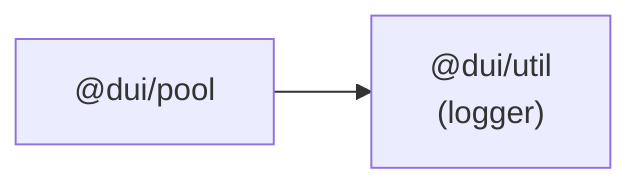

# @dui/pool — 通用池化資源底座

## 1. 概述

`@dui/pool` 提供一個泛型抽象類別 `BasePool<K, V>`，作為 WebCube2027 中所有池化資源的統一底座。包含 LRU/LFU 追蹤、dirty flag + 延遲批量寫回（Write-Back Buffer）、idle eviction、persistent 保護、自適應心跳修復。

### 解決的問題

- PoolCore（DB 連線池）、AiResourcePool、VocabularyPool、LoginAttemptPool 等各自實作自己的池邏輯，重複程式碼多
- 缺少統一的 idle eviction、flush、heartbeat 機制
- 維護困難，新增功能要在每個池各改一次

---

## 2. 型別定義

### `PoolItem<V>`

```typescript
interface PoolItem<V> {
  /** 實際快取/儲存的值 */
  value: V;
  /** 最後存取時間戳 (ms) — 用於 LRU eviction */
  lastAccessed: number;
  /** 總存取次數 — 用於 LFU 排序 */
  accessCount: number;
  /** 資料是否已修改，需要 flush 寫回 */
  isDirty: boolean;
  /**
   * 是否為常駐項目。
   * persistent = true 的項目不會被 idle eviction 清除，
   * 且會在 onHeartbeat() 中被定期 ping 以保持連線。
   */
  persistent: boolean;
}
```

### `PoolOptions`

```typescript
interface PoolOptions {
  /** Flush 定時器間隔 (ms)。不設定則不啟動 flush */
  flushIntervalMs?: number;
  /** Cleanup 定時器間隔 (ms)。不設定則不啟動 idle eviction */
  cleanupIntervalMs?: number;
  /** 超過此毫秒數未存取即視為冷資料，可被 evict */
  maxIdleMs?: number;
  /** Heartbeat 定時器間隔 (ms)。不設定則不啟動 heartbeat */
  heartbeatIntervalMs?: number;
}
```

---

## 3. BasePool<K, V> API

### 建構子

```typescript
abstract class BasePool<K, V> {
  constructor(options?: PoolOptions);
}
```

- 不傳 `options` = 所有定時器關閉，純記憶體快取
- 傳入 `cleanupIntervalMs` + `maxIdleMs` = 啟用 idle eviction
- 傳入 `heartbeatIntervalMs` = 啟用定期心跳
- 傳入 `flushIntervalMs` = 啟用延遲批量寫回

### 核心方法

| 方法 | 說明 |
|------|------|
| `get(key): V \| null` | 取得值，更新 `lastAccessed` + `accessCount` |
| `set(key, value, markDirty?, persistent?)` | 設定值。`markDirty` 控制是否標記為髒資料（預設 true）。`persistent` 控制是否為常駐項目（預設 false） |
| `delete(key): boolean` | 刪除項目 |
| `has(key): boolean` | 檢查 key 是否存在，**不**更新存取時間 |
| `keys(): K[]` | 取得所有 key |
| `flushToStorage()` | 手動觸發 flush，將所有 dirty 項目寫回 |
| `destroy()` | 停止所有定時器、清除所有項目、呼叫 onEvict |

### 定時器行為

| 定時器 | 觸發條件 | 行為 |
|--------|----------|------|
| **cleanup** | 同時設定 `cleanupIntervalMs` + `maxIdleMs` | 每秒週期掃描，evict 超過 `maxIdleMs` 未存取且非 `persistent` 的項目 |
| **flush** | 設定 `flushIntervalMs` | 每週期遍歷 dirty 項目，批次呼叫 `onFlush()`，完成後清除 dirty flag |
| **heartbeat** | 設定 `heartbeatIntervalMs` | 每週期呼叫 `onHeartbeat()`，子類別可在此實作 ping/health check |

---

## 4. `persistent` 常駐標記

控制池化項目的生命周期，在建入池時宣告：

```typescript
this.set('SYSTEM', l2, false, true);
//            key   value dirty persistent
```

### 行為

| `persistent` | 是否被 idle evict | 是否被 heartbeat ping |
|---|---|---|
| `false`（預設） | 是 | 否 |
| `true` | 否 | 是（子類別在 `onHeartbeat()` 中實作） |

### 使用場景

- **PoolCore L2 SYSTEM** → `persistent: true`，中央資料庫永不 evict
- **PoolCore L3 tenant connections** → 不設 persistent，30 分鐘 idle 自動斷線
- **AI Pool** → cleanup 關閉（不設 `cleanupIntervalMs`），persistent 與否無影響
- **Vocabulary Pool** → cleanup 開啟，少用的單字自動 evict；特殊保護字彙可設 `persistent: true`

---

## 5. 生命週期 Hooks（子類別實作）

### `protected abstract onFlush(dirtyItems: Map<K, V>): Promise<void>`

flush 定時器觸發時呼叫，將髒資料批次寫回儲存層。

範例：VocabularyPool 將標記了 dirty flag 的單字最後讀取時間批次寫回資料庫。

### `protected abstract onEvict(evictedItems: Map<K, V>): Promise<void>`

cleanup 定時器 evict 項目時呼叫，用來優雅釋放資源（關閉連線、釋放記憶體）。

範例：PoolCore 關閉 L3 閒置資料庫連線。

### `protected async onHeartbeat(): Promise<void>`

heartbeat 定時器觸發時呼叫，預設為空（optional override）。

範例：PoolCore 對 SYSTEM 發送 `getById('_heartbeat_')` 保持連線活著，失敗時自動重連。

---

## 6. Cleanup / Flush / Heartbeat 啟動時機

三種定時器各自獨立，只在對應選項被設定時啟動：

```typescript
constructor(options?: PoolOptions) {
  if (cleanupIntervalMs && maxIdleMs) startCleanupTimer();
  if (flushIntervalMs) startFlushTimer();
  if (heartbeatIntervalMs) startHeartbeatTimer();
}
```

這意味著：
- **不傳選項** → 純記憶體 Map，無自動清理、無 flush、無心跳
- **只傳 cleanup** → 啟用 idle eviction
- **只傳 flush** → 啟用延遲寫回
- **只傳 heartbeat** → 啟用定期心跳

---

## 7. 相依關係



---

## 8. 規格版本

| 版本 | 日期 | 變更 |
|------|------|------|
| 0.1.0 | 2026-07-23 | 初始規格：BasePool、PoolItem、PoolOptions、persistent flag、三種定時器 |