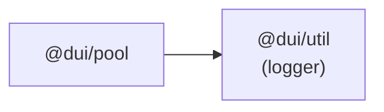

# @dui/pool — 通用池化資源底座

## 1. 概述

`@dui/pool` 提供一個泛型抽象類別 `BasePool<K, V>`，作為 WebCube2027 中所有池化資源的統一底座。包含 LRU/LFU 追蹤、dirty flag + 延遲批量寫回（Write-Back Buffer）、idle eviction、persistent 保護、自適應心跳修復。

### 解決的問題

- BasePool 作為泛型底座，統一管理池的生命週期、LRU 淘汰、dirty flush、idle eviction 與 heartbeat
- 缺少統一的 idle eviction、flush、heartbeat 機制
- 維護困難，新增功能要在每個池各改一次

---

## 2. 型別定義

### `PoolItem<V>`

```typescript
interface PoolItem<V> {
  /** 實際快取/儲存的值 */
  value: V;
  /** 最後存取時間戳 (ms) — 用於 LRU eviction */
  lastAccessed: number;
  /** 總存取次數 — 用於 LFU 排序 */
  accessCount: number;
  /** 資料是否已修改，需要 flush 寫回 */
  isDirty: boolean;
  /**
   * 是否為常駐項目。
   * persistent = true 的項目不會被 idle eviction 清除，
   * 且會在 onHeartbeat() 中被定期 ping 以保持連線。
   */
  persistent: boolean;
}
```

### `PoolOptions`

```typescript
interface PoolOptions {
  // ── 定時器設定 ─────────────────────────────
  flushIntervalMs?: number;
  cleanupIntervalMs?: number;
  maxIdleMs?: number;
  heartbeatIntervalMs?: number;

  // ── 容量管理（v0.2.0） ─────────────────────
  /** 硬容量上限。達到此值時新插入觸發同步 LRU 淘汰；無可淘汰項目時拋出 PoolFullError */
  maxSize?: number;
  /** 軟水位線比例（0.0–1.0，預設 0.8 = 80%）。超過時以 queueMicrotask 非同步背景 LRU 淘汰 */
  highWatermarkRatio?: number;
  /** 最小保留數。Heartbeat 檢查若低於此值，自動呼叫 onWarmup() 預熱補足 */
  minSize?: number;
}
```

| 選項 | 類型 | 預設 | 說明 |
|------|------|------|------|
| `flushIntervalMs` | `number` | — | Flush 定時器間隔。不設定則不啟動自動 flush |
| `cleanupIntervalMs` | `number` | — | Idle eviction 定時器間隔。需同時設定 `maxIdleMs` |
| `maxIdleMs` | `number` | — | 超過此毫秒數未存取即視為冷資料，可被 evict |
| `heartbeatIntervalMs` | `number` | — | Heartbeat 定時器間隔。不設定則不啟動 |
| `maxSize` | `number` | — | **v0.2.0** 硬容量上限。池滿時觸發同步 LRU 淘汰；全為 persistent 時拋 `PoolFullError` |
| `highWatermarkRatio` | `number` | `0.8` | **v0.2.0** 軟水位線。超過 `maxSize × ratio` 時背景非同步 LRU 淘汰，不阻塞寫入 |
| `minSize` | `number` | — | **v0.2.0** 最小保留數。Heartbeat 檢查低於此值時呼叫 `onWarmup()` 預熱 |

---

## 3. BasePool<K, V> API

### 建構子

```typescript
abstract class BasePool<K, V> {
  constructor(options?: PoolOptions);
}
```

- 不傳 `options` = 所有定時器關閉，純記憶體快取
- 傳入 `cleanupIntervalMs` + `maxIdleMs` = 啟用 idle eviction
- 傳入 `heartbeatIntervalMs` = 啟用定期心跳
- 傳入 `flushIntervalMs` = 啟用延遲批量寫回
- 傳入 `maxSize` = 啟用硬容量上限 + 軟水位線防護（需一並設定 `highWatermarkRatio`）
- 傳入 `minSize` = 啟用 Heartbeat 自動預熱（需同時設定 `heartbeatIntervalMs`）

### 核心方法

| 方法 | 說明 |
|------|------|
| `get(key): V \| null` | 取得值，更新 `lastAccessed` + `accessCount`。**v0.2.0** 將 key 重排至 Map 尾端實作 O(1) LRU |
| `set(key, value, markDirty?, persistent?)` | 設定值。**v0.2.0** 現有 key 先刪除再插入以維持 LRU 順序；當 `maxSize` 已達且無可淘汰項目時拋出 `PoolFullError` |
| `delete(key): Promise<boolean>` | **v0.2.0 改為 async**。刪除時先 flush dirty 資料（防止資料遺失），再呼叫 `onEvict` 釋放底層資源（如 DB 連線），最後才從 Map 移除 |
| `has(key): boolean` | 檢查 key 是否存在，**不**更新存取時間 |
| `keys(): K[]` | 取得所有 key（一次性配置陣列）。大型池建議使用 `keysIterator()` |
| `keysIterator(): IterableIterator<K>` | **v0.2.0 新增**。串流迭代器，避免一次性配置大型陣列 |
| `getStatus(): PoolStatus` | **v0.3.0 新增**。回傳完整狀態快照（容量/效能/執行中旗標/時間戳/lastError），供 Dashboard 或監控系統 Polling |
| `resetMetrics(): void` | **v0.3.0 新增**。歸零累計效能計數器（hits/misses/evictions/flushes/flushErrors），不影響診斷資訊 |
| `getItemsOverview(): PoolItemOverview[]` | **v0.3.0 新增**。回傳所有項目的元資料快照（不含 value），依 Map 順序 = LRU 順序。子類別可 override 擴充 |
| `flushToStorage()` | 手動觸發 flush。**v0.2.0 改進**：先收集 dirty 項目，呼叫 `onFlush()` 成功後才清空 `isDirty`；失敗時保留 dirty flag 供下次重試 |
| `destroy()` | **v0.2.0 改為 async**。依序：停止所有定時器 → flush 殘餘 dirty 項目 → 對所有殘留項目呼叫 `onEvict` → 清除內部狀態 |

### 定時器行為

v0.2.0 起，所有定時器加入**防重疊鎖**與**錯誤捕獲**：

| 定時器 | 觸發條件 | 行為 | 防護機制 |
|--------|----------|------|----------|
| **cleanup** | 同時設定 `cleanupIntervalMs` + `maxIdleMs` | 掃描 evict 超過 `maxIdleMs` 未存取且非 `persistent` 的項目。**dirty 項目先 flush 再 evict**，防止資料遺失 | `_isCleaning` 防重疊、`try/catch` 防 unhandled rejection |
| **flush** | 設定 `flushIntervalMs` | 遍歷 dirty 項目，批次呼叫 `onFlush()`，成功後才清 dirty flag | `_isFlushing` 防重疊、`try/catch` 防 unhandled rejection |
| **heartbeat** | 設定 `heartbeatIntervalMs` | 呼叫 `onHeartbeat()`，子類別可實作 ping/health check | `_isHeartbeating` 防重疊、`try/catch` 防 unhandled rejection |

---

## 4. `persistent` 常駐標記

控制池化項目的生命周期，在建入池時宣告：

```typescript
this.set('SYSTEM', l2, false, true);
//            key   value dirty persistent
```

### 行為

| `persistent` | 是否被 idle evict | 是否被 heartbeat ping |
|---|---|---|
| `false`（預設） | 是 | 否 |
| `true` | 否 | 是（子類別在 `onHeartbeat()` 中實作） |

### 使用場景

- **data-gateway L2 SYSTEM** → `persistent: true`，中央資料庫永不 evict（此為 data-gateway 職責，非 pool 層級關注）
- **data-gateway L3 tenant connections** → 不設 persistent，30 分鐘 idle 自動斷線（此為 data-gateway 職責，非 pool 層級關注）
- **AI Pool** → cleanup 關閉（不設 `cleanupIntervalMs`），persistent 與否無影響
- **Vocabulary Pool** → cleanup 開啟，少用的單字自動 evict；特殊保護字彙可設 `persistent: true`

---

## 5. 生命週期 Hooks（子類別實作）

### `protected abstract onFlush(dirtyItems: Map<K, V>): Promise<void>`

flush 定時器觸發時呼叫，將髒資料批次寫回儲存層。

範例：VocabularyPool 將標記了 dirty flag 的單字最後讀取時間批次寫回資料庫。

### `protected abstract onEvict(evictedItems: Map<K, V>): Promise<void>`

cleanup 定時器 evict 項目時呼叫，用來優雅釋放資源（關閉連線、釋放記憶體）。

範例：DbPool（data-gateway 內部實作）關閉 L3 閒置資料庫連線。

### `protected async onHeartbeat(): Promise<void>`

heartbeat 定時器觸發時呼叫，預設為空（optional override）。v0.2.0 起 heartbeat 完成後會自動檢查 `minSize`，低於門檻時呼叫 `onWarmup()`。

範例：DbPool（data-gateway 內部實作）對 SYSTEM 發送 `getById('_heartbeat_')` 保持連線活著，失敗時自動重連。

### `protected async onWarmup(deficit: number): Promise<void>`

**v0.2.0 新增**。當 `PoolOptions.minSize` 已設定且 heartbeat 發現目前容量低於此值時自動呼叫。子類別應在此預先建立資源（開啟連線、分配緩衝區）補足缺口。

| 參數 | 說明 |
|------|------|
| `deficit` | 需要補充的項目數量（`minSize - 目前數量`） |

範例：DbPool（data-gateway 內部實作）在開機初期連線不足時預先建立 L3 DB 連線。

---

## 6. Cleanup / Flush / Heartbeat 啟動時機

三種定時器各自獨立，只在對應選項被設定時啟動：

```typescript
constructor(options?: PoolOptions) {
  if (cleanupIntervalMs && maxIdleMs) startCleanupTimer();
  if (flushIntervalMs) startFlushTimer();
  if (heartbeatIntervalMs) startHeartbeatTimer();
}
```

這意味著：
- **不傳選項** → 純記憶體 Map，無自動清理、無 flush、無心跳
- **只傳 cleanup** → 啟用 idle eviction
- **只傳 flush** → 啟用延遲寫回
- **只傳 heartbeat** → 啟用定期心跳

### v0.2.0 防護機制

所有定時器皆使用 `setInterval(async () => { ... })` 包裝，內建：

| 機制 | 說明 |
|------|------|
| **防重疊鎖** | 使用 boolean guard（`_isFlushing` / `_isCleaning` / `_isHeartbeating`）。若前一週期尚未完成，直接跳過本次觸發，杜絕併發競態 |
| **錯誤捕獲** | 每週期以 `try/catch/finally` 包覆，異常經 `@dui/util` logger 輸出，不產生 unhandled rejection |
| **最終一致** | Flush 失敗時保留 `isDirty = true`，下次定時器觸發時繼續重試 |

---

## 7. 水位線保護與 LRU 最佳化（v0.2.0）

### 7.1 軟水位線（Soft Watermark）

當 `maxSize` 與 `highWatermarkRatio`（預設 0.8）已設定，且池容量達到 `maxSize × ratio` 時，`set()` 在插入新 key 後自動觸發 **背景非同步 LRU 淘汰**：

```
容量 ≥ maxSize × 0.8  →  queueMicrotask(_evictLru)  // 不阻塞當前寫入
```

- 使用 `queueMicrotask` 排程，完全非同步、零阻塞
- 目標：平滑釋放至 `(ratio - 10%) × maxSize`（例如 80% → 70%）
- 若低於 `minSize` 則以 `minSize` 為地板

### 7.2 硬上限（Hard Limit）

當池容量已達 `maxSize`，`set()` 在插入新 key 前觸發 **同步緊急 LRU 淘汰**：

```
容量 = maxSize  →  同步 _evictLru(1)  // 插前先騰出一個位置
```

- 若所有項目皆為 `persistent` 且無可淘汰者，拋出 `PoolFullError` 進行系統自我保護
- 淘汰的項目以 `queueMicrotask` 非同步呼叫 `onEvict()`，不阻塞插入

### 7.3 O(1) LRU 重排

利用 JavaScript `Map` 保留插入順序的特性，在 `get()` 與 `set()` 中實作 O(1) LRU：**

| 方法 | 實作 |
|------|------|
| `get(key)` 命中 | `this.items.delete(key); this.items.set(key, item)` → key 移至 Map 尾端 |
| `set(key)` 已存在 | 同上，先刪除再插入 → 保持最新存取順序 |

Map 前端永遠是最久未存取的 key，`_evictLru()` 直接從頭遍歷即可 O(n) 找到最舊的非常駐項目。

### 7.4 PoolFullError

```typescript
class PoolFullError extends Error {
  override readonly name = 'PoolFullError';
  constructor(message: string);
}
```

當硬上限觸發且所有項目皆為 `persistent`、無任何可淘汰項目時拋出。呼叫端應據此調整寫入策略（節流、降級、擴容等）。

### 7.5 MinSize 自動預熱

當 `minSize` 與 `heartbeatIntervalMs` 皆已設定時，heartbeat 定時器每次觸發完成 `onHeartbeat()` 後自動檢查：

```
目前數量 < minSize  →  await onWarmup(minSize - 目前數量)
```

子類別應在 `onWarmup(deficit)` 中實作資源預建立（開啟連線、分配緩衝區等）。
---

## 8. 可觀測性（v0.3.0）

BasePool 內建輕量可觀測性介面，供 Dashboard 或監控系統定時拉取狀態快照。所有計數器在 Pool 運作過程中自動維護。

### 8.1 快照型別

```typescript
/** 單一項目的元資料（不含實際 value） */
interface PoolItemOverview {
  key: string;           // String(key) 轉換，安全序列化
  lastAccessed: number;  // 最後存取時間戳 (ms)
  accessCount: number;   // 總存取次數
  isDirty: boolean;      // 是否有未 flush 的修改
  persistent: boolean;   // 是否為常駐項目
  idleMs: number;        // 距離上次存取經過的毫秒數（快照時計算）
}

/** Pool 完整狀態快照 */
interface PoolStatus {
  // 容量
  totalItems: number;
  persistentItems: number;
  dirtyItems: number;
  capacityUsage: number | null;  // null 表示未設定 maxSize

  // 效能
  hits: number;
  misses: number;
  hitRate: number;        // hits / (hits + misses)
  evictions: number;      // 累計淘汰次數
  flushes: number;        // 累計 flush 成功次數
  flushErrors: number;    // 累計 flush 失敗次數

  // 執行中狀態
  isFlushing: boolean;
  isCleaning: boolean;
  isHeartbeating: boolean;

  // 時間戳（偵測定時器卡死）
  lastFlushAt: number | null;
  lastCleanupAt: number | null;
  lastHeartbeatAt: number | null;

  // 最後錯誤
  lastError: { time: number; message: string } | null;
}
```

### 8.2 公開 API

| 方法 | 回傳 | 說明 |
|------|------|------|
| `getStatus()` | `PoolStatus` | 回傳完整狀態快照。內含容量、效能計數、執行中旗標、時間戳、最後錯誤。適合 Dashboard 每 2–5 秒 Polling 拉取 |
| `resetMetrics()` | `void` | 歸零 `hits` / `misses` / `evictions` / `flushes` / `flushErrors`。不影響時間戳與 lastError。適合分時段統計 |
| `getItemsOverview()` | `PoolItemOverview[]` | 回傳所有項目的元資料（不含 value）。依 Map 順序 = LRU 順序（最舊在前）。排序交給前端。子類別可 override 擴充欄位（如 `dbName`） |

### 8.3 使用範例

```typescript
// 監控端定時拉取
const status = pool.getStatus();
console.log(`Hit rate: ${(status.hitRate * 100).toFixed(1)}%`);
console.log(`Capacity: ${status.totalItems}/${status.maxSize}`);

// 前端 Dashboard 取得 LRU 熱力圖資料
const items = pool.getItemsOverview();
// 前端自行排序：items.sort((a, b) => b.accessCount - a.accessCount);

// 分時段統計（例如每小時 reset）
setInterval(() => {
  reportMetrics(pool.getStatus());
  pool.resetMetrics();
}, 3600_000);
```

### 8.4 子類別擴充

子類別可 override `getItemsOverview()` 加入型別安全的欄位：

```typescript
// 擴充範例：資料庫連線池（data-gateway 內部實作）
interface DbPoolItemOverview extends PoolItemOverview {
  dbName: string;
}

class DbPool extends BasePool<string, L3Cache> {
  override getItemsOverview(): DbPoolItemOverview[] {
    const base = super.getItemsOverview();
    return base.map((item) => ({ ...item, dbName: item.key }));
  }
}
```

---

## 9. 相依關係


```mermaid
graph LR
  A["@dui/pool"] --> B["@dui/util<br/>(logger)"]
```

---

## 10. 規格版本

> 版本紀錄已移至 [版本紀錄.md](./版本紀錄.md)。