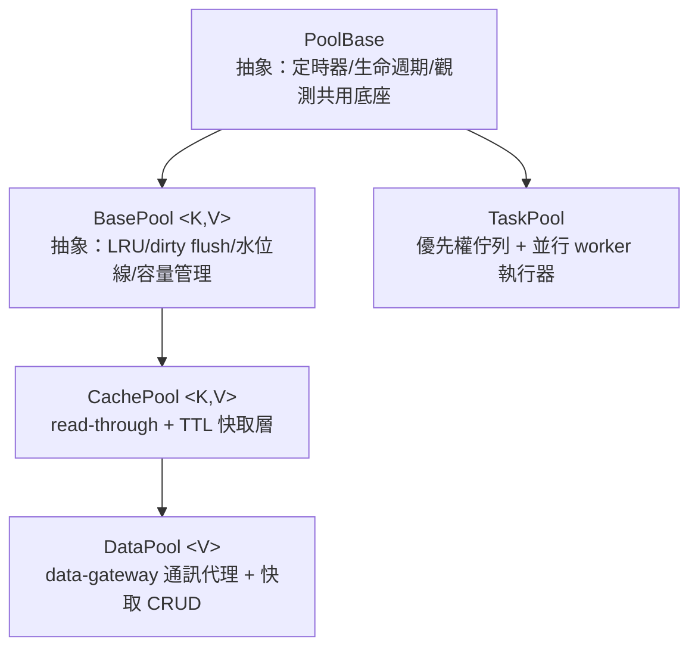
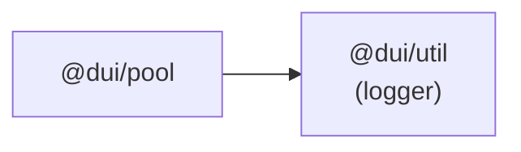

# @dui/pool — 通用池化資源底座

## 1. 概述

`@dui/pool` 提供一個「池化資源」階層架構，作為 WebCube2027 中所有池化資源的統一底座。共有四種公開類別，由兩條繼承線組成：


```mermaid
graph TD
  PB[PoolBase<br/>抽象：定時器/生命週期/觀測共用底座]
  BP[BasePool&nbsp;&lt;K,V&gt;<br/>抽象：LRU/dirty flush/水位線/容量管理]
  CP[CachePool&nbsp;&lt;K,V&gt;<br/>read-through + TTL 快取層]
  DP[DataPool&nbsp;&lt;V&gt;<br/>data-gateway 通訊代理 + 快取 CRUD]
  TP[TaskPool<br/>優先權佇列 + 並行 worker 執行器]

  PB --> BP
  BP --> CP
  CP --> DP
  PB --> TP
```

- **PoolBase** — 純抽象底座，只提供共用基礎設施：定時器管理（cleanup / heartbeat）、生命週期 hooks（`cleanup()` / `onHeartbeat()` / `getCurrentSize()`）、防重疊鎖、觀測計數、`reconfigure()` / `destroy()`。**不持有任何項目容器**。
- **BasePool<K, V>** — 泛型儲存池抽象層。在 PoolBase 之上加入項目容器（`Map<K, PoolItem<V>>`）、LRU/LFU 追蹤、dirty flag + 延遲批量寫回（Write-Back Buffer）、idle eviction、persistent 保護、軟/硬水位線保護、O(1) LRU 重排、minSize 自動預熱與完整可觀測性。子類別實作 `onFlush()` / `onEvict()` 寫回與資源釋放。
- **CachePool<K, V>** — read-through 快取層。在 BasePool 之上加入 `getOrFetch()`（miss → fetch → cache）、TTL 過期、`invalidateByPrefix()` 批次失效、`clearCache()`。`onFlush`/`onEvict` 為空實作（快取副本不需外部寫回）。
- **DataPool<V>** — data-gateway 通訊代理 + 快取 CRUD。在 CachePool 之上加入 DG 連線（URL/API key resolver）、泛用 HTTP 代理 `request()`、泛用 CRUD（`getById` / `list` / `create` / `update` / `remove`）。Gateway 的資料代理層（如 auth-gateway 的 AccountPool）繼承自此。
- **TaskPool** — 任務執行器，**不是儲存池**。在 PoolBase 之上加入多優先權佇列、並行 worker 執行、自動擴縮（auto-scale）、背壓（backpressure）。適合非同步任務排程。

### 解決的問題

- 統一的池生命週期、LRU 淘汰、dirty flush、idle eviction 與 heartbeat 機制
- 過去缺少統一機制，每個池各自實作 → 維護困難
- 現在透過分層：共用基礎設施在 PoolBase，儲存語意在 BasePool，快取語意在 CachePool，DG 通訊語意在 DataPool

---

## 2. 型別定義

### `PoolItem<V>`

```typescript
interface PoolItem<V> {
  /** 實際快取/儲存的值 */
  value: V;
  /** 最後存取時間戳 (ms) — 用於 LRU eviction */
  lastAccessed: number;
  /** 總存取次數 — 用於 LFU 排序 */
  accessCount: number;
  /** 資料是否已修改，需要 flush 寫回 */
  isDirty: boolean;
  /**
   * 是否為常駐項目。
   * persistent = true 的項目不會被 idle eviction 清除，
   * 且會在 onHeartbeat() 中被定期 ping 以保持連線。
   */
  persistent: boolean;
}
```

### `PoolBaseOptions`

所有池型別共用的最小選項（PoolBase 層級）：

```typescript
interface PoolBaseOptions {
  /** Cleanup 定時器間隔 (ms)。設定後週期呼叫 cleanup() */
  cleanupIntervalMs?: number;
  /** Heartbeat 定時器間隔 (ms)。設定後週期呼叫 onHeartbeat() */
  heartbeatIntervalMs?: number;
  /** 硬容量 / 併發上限（各子類別語意不同） */
  maxSize?: number;
  /** 最小保留數 / worker 下限（各子類別語意不同） */
  minSize?: number;
}
```

| 選項 | 類型 | 說明 |
|------|------|------|
| `cleanupIntervalMs` | `number` | Cleanup 定時器間隔。不設定則不啟動 |
| `heartbeatIntervalMs` | `number` | Heartbeat 定時器間隔。不設定則不啟動 |
| `maxSize` | `number` | BasePool = 硬容量上限；TaskPool = 最大併發 worker |
| `minSize` | `number` | BasePool = 預熱目標；TaskPool = 最小 worker |

### `PoolOptions`

BasePool / CachePool / DataPool 的選項（繼承 PoolBaseOptions）：

```typescript
interface PoolOptions extends PoolBaseOptions {
  // ── 定時器設定 ─────────────────────────────
  flushIntervalMs?: number;
  maxIdleMs?: number;

  // ── 容量管理（v0.2.0） ─────────────────────
  /** 硬容量上限。達到此值時新插入觸發同步 LRU 淘汰；無可淘汰項目時拋出 PoolFullError */
  highWatermarkRatio?: number;
}
```

| 選項 | 類型 | 預設 | 說明 |
|------|------|------|------|
| `flushIntervalMs` | `number` | — | Flush 定時器間隔。不設定則不啟動自動 flush |
| `cleanupIntervalMs` | `number` | — | Idle eviction 定時器間隔。需同時設定 `maxIdleMs` |
| `maxIdleMs` | `number` | — | 超過此毫秒數未存取即視為冷資料，可被 evict |
| `heartbeatIntervalMs` | `number` | — | Heartbeat 定時器間隔。不設定則不啟動 |
| `maxSize` | `number` | — | **v0.2.0** 硬容量上限。池滿時觸發同步 LRU 淘汰；全為 persistent 時拋 `PoolFullError` |
| `highWatermarkRatio` | `number` | `0.8` | **v0.2.0** 軟水位線。超過 `maxSize × ratio` 時背景非同步 LRU 淘汰，不阻塞寫入 |
| `minSize` | `number` | — | **v0.2.0** 最小保留數。Heartbeat 檢查若低於此值，自動呼叫 `onWarmup()` 預熱 |

### `TaskPoolOptions` 與 `TaskPoolStatus`（v0.4.0）

```typescript
interface TaskQueueConfig {
  /** 優先權（數字愈小愈優先，0 = 最高） */
  priority: number;
  /** 單一佇列的併發上限（選擇性） */
  concurrency?: number;
}

interface TaskPoolOptions extends PoolBaseOptions {
  /** 最大併發 worker（必填） */
  maxConcurrency: number;
  /** 最小 idle worker（預設 maxConcurrency/4，至少 1） */
  minConcurrency?: number;
  /** 啟用自動擴縮（預設 false） */
  autoScale?: boolean;
  /** 佇列深度比例觸發 scale-up（0.0–1.0，預設 0.8） */
  scaleUpThreshold?: number;
  /** 佇列深度比例觸發 scale-down（0.0–1.0，預設 0.3） */
  scaleDownThreshold?: number;
  /** 每次擴縮增減的 worker 數（預設 2） */
  scaleStep?: number;
  /** 兩次擴縮事件最小間隔 ms（預設 30_000） */
  cooldownMs?: number;
  /** 背壓上限：最多允許 pending 任務數（預設 1000，0 = 不限） */
  maxQueueSize?: number;
  /** 預設佇列名稱（預設 "default"） */
  defaultQueue?: string;
  /** 佇列定義。key = 佇列名稱 */
  queues?: Record<string, TaskQueueConfig>;
  /** 選擇性資料源（CachePool/DataPool），任務執行時作為 ctx.data 傳入 */
  dataSource?: { getOrFetch?(key, fetcher): Promise<unknown | null>; get?(key): unknown | null };
}

interface TaskPoolStatus {
  activeWorkers: number;        // 目前執行中的 worker 數
  maxConcurrency: number;       // 目標最大併發
  minConcurrency: number;       // 目標最小併發
  autoScale: boolean;           // 是否啟用自動擴縮
  pendingTasks: number;         // 所有佇列累計 pending
  queueDetails: Array<{ name; priority; pending; active; concurrency? }>;  // 各佇列細目
  queuePressure: number | null; // pending / maxQueueSize（0 = 不限制）
  completedTasks: number;       // 累計完成
  rejectedTasks: number;        // 累計背壓拒絕
  isCleaning: boolean;          // cleanup/auto-scale 週期執行中
  lastCleanupAt: number | null; // 最後 cleanup 時間戳
  lastError: { time; message } | null;
}
```

---

## 3. PoolBase — 共用底座（抽象）

所有池型別的根基，提供與「具體儲存內容」無關的共用基礎設施。**不持有項目容器**，因此 `BasePool` 與 `TaskPool` 都繼承它。

### 建構子與定時器

```typescript
abstract class PoolBase {
  constructor(options?: PoolBaseOptions);
}
```

| 定時器 | 觸發條件 | 呼叫 hook | 防護 |
|--------|----------|-----------|------|
| cleanup | `cleanupIntervalMs` | `cleanup()` | `_isCleaning` 防重疊 + `try/catch` |
| heartbeat | `heartbeatIntervalMs` | `onHeartbeat()` | `_isHeartbeating` 防重疊 + `try/catch` |

定時器每週期以 `try/catch/finally` 包覆：成功時紀錄 `_lastCleanupAt` / `_lastHeartbeatAt`，失敗時寫入 `_lastError` 並經 `@dui/util` logger 輸出，不產生 unhandled rejection。

### 公開 API

| 方法 | 說明 |
|------|------|
| `reconfigure(options: Partial<PoolBaseOptions>): void` | 執行期更新選項。注意：定時器間隔異動需 destroy 後重建才生效 |
| `destroy(): Promise<void>` | 停止所有定時器（cleanup + heartbeat），等待執行中的週期完成 |

### 子類別 hooks（實作）

```typescript
/** 週期性清理 / eviction / auto-scale 邏輯（cleanupIntervalMs 設定時呼叫） */
protected abstract cleanup(): Promise<void>;

/** 週期性心跳。預設空，可選擇性 override */
protected async onHeartbeat(): Promise<void>;

/** 回報目前管理的項目/worker 數量（供狀態報告） */
abstract getCurrentSize(): number;
```

### 觀測計數（protected）

`_evictions`、`_lastCleanupAt`、`_lastHeartbeatAt`、`_lastError`、`_isCleaning`、`_isHeartbeating`、`formatKey(key)`。

---

## 4. BasePool<K, V> API

繼承 `PoolBase`，加入項目容器與儲存語意。這是「泛型儲存池」的核心抽象。

### 建構子

```typescript
abstract class BasePool<K, V> extends PoolBase {
  constructor(options?: PoolOptions);
}
```

- 不傳 `options` = 所有定時器關閉，純記憶體快取
- 傳入 `cleanupIntervalMs` + `maxIdleMs` = 啟用 idle eviction
- 傳入 `heartbeatIntervalMs` = 啟用定期心跳
- 傳入 `flushIntervalMs` = 啟用延遲批量寫回（BasePool 專屬定時器，PoolBase 無）
- 傳入 `maxSize` = 啟用硬容量上限 + 軟水位線防護（需一並設定 `highWatermarkRatio`）
- 傳入 `minSize` = 啟用 Heartbeat 自動預熱（需同時設定 `heartbeatIntervalMs`）

### 核心方法

| 方法 | 說明 |
|------|------|
| `get(key): V \| null` | 取得值，更新 `lastAccessed` + `accessCount`。**v0.2.0** 將 key 重排至 Map 尾端實作 O(1) LRU |
| `set(key, value, markDirty?, persistent?)` | 設定值。**v0.2.0** 現有 key 先刪除再插入以維持 LRU 順序；當 `maxSize` 已達且無可淘汰項目時拋出 `PoolFullError` |
| `delete(key): Promise<boolean>` | **v0.2.0 改為 async**。刪除時先 flush dirty 資料（防止資料遺失），再呼叫 `onEvict` 釋放底層資源（如 DB 連線），最後才從 Map 移除 |
| `has(key): boolean` | 檢查 key 是否存在，**不**更新存取時間 |
| `keys(): K[]` | 取得所有 key（一次性配置陣列）。大型池建議使用 `keysIterator()` |
| `keysIterator(): IterableIterator<K>` | **v0.2.0 新增**。串流迭代器，避免一次性配置大型陣列 |
| `flushToStorage()` | 手動觸發 flush。**v0.2.0 改進**：先收集 dirty 項目，呼叫 `onFlush()` 成功後才清空 `isDirty`；失敗時保留 dirty flag 供下次重試 |
| `destroy()` | **v0.2.0 改為 async**。依序：停止所有定時器 → flush 殘餘 dirty 項目 → 對所有殘留項目呼叫 `onEvict` → 清除內部狀態 |
| `getStatus(): PoolStatus` | **v0.3.0 新增**。回傳完整狀態快照（容量/效能/執行中旗標/時間戳/lastError），供 Dashboard 或監控系統 Polling |
| `resetMetrics(): void` | **v0.3.0 新增**。歸零累計效能計數器（hits/misses/evictions/flushes/flushErrors），不影響診斷資訊 |
| `getItemsOverview(): PoolItemOverview[]` | **v0.3.0 新增**。回傳所有項目的元資料快照（不含 value），依 Map 順序 = LRU 順序。子類別可 override 擴充 |

### 定時器行為

v0.2.0 起，所有定時器加入**防重疊鎖**與**錯誤捕獲**：

| 定時器 | 擁有者 | 觸發條件 | 行為 | 防護機制 |
|--------|--------|----------|------|----------|
| **cleanup** | PoolBase | 同時設定 `cleanupIntervalMs` + `maxIdleMs` | 掃描 evict 超過 `maxIdleMs` 未存取且非 `persistent` 的項目。**dirty 項目先 flush 再 evict**，防止資料遺失 | `_isCleaning` 防重疊、`try/catch` 防 unhandled rejection |
| **flush** | BasePool | 設定 `flushIntervalMs` | 遍歷 dirty 項目，批次呼叫 `onFlush()`，成功後才清 dirty flag | `_isFlushing` 防重疊、`try/catch` 防 unhandled rejection |
| **heartbeat** | PoolBase | 設定 `heartbeatIntervalMs` | 呼叫 `onHeartbeat()`，子類別可實作 ping/health check；完成後自動檢查 `minSize` 預熱 | `_isHeartbeating` 防重疊、`try/catch` 防 unhandled rejection |

---

## 5. `persistent` 常駐標記

控制池化項目的生命周期，在建入池時宣告：

```typescript
this.set('SYSTEM', l2, false, true);
//            key   value dirty persistent
```

### 行為

| `persistent` | 是否被 idle evict | 是否被 heartbeat ping |
|---|---|---|
| `false`（預設） | 是 | 否 |
| `true` | 否 | 是（子類別在 `onHeartbeat()` 中實作） |

### 使用場景

- **data-gateway L2 SYSTEM** → `persistent: true`，中央資料庫永不 evict（此為 data-gateway 職責，非 pool 層級關注）
- **data-gateway L3 tenant connections** → 不設 persistent，30 分鐘 idle 自動斷線（此為 data-gateway 職責，非 pool 層級關注）
- **AI Pool** → cleanup 關閉（不設 `cleanupIntervalMs`），persistent 與否無影響
- **Vocabulary Pool** → cleanup 開啟，少用的單字自動 evict；特殊保護字彙可設 `persistent: true`

---

## 6. 生命週期 Hooks（子類別實作）

### `protected abstract onFlush(dirtyItems: Map<K, V>): Promise<void>`

flush 定時器觸發時呼叫，將髒資料批次寫回儲存層。

範例：VocabularyPool 將標記了 dirty flag 的單字最後讀取時間批次寫回資料庫。

### `protected abstract onEvict(evictedItems: Map<K, V>): Promise<void>`

cleanup 定時器 evict 項目時呼叫，用來優雅釋放資源（關閉連線、釋放記憶體）。

範例：DbPool（data-gateway 內部實作）關閉 L3 閒置資料庫連線。

### `protected async onHeartbeat(): Promise<void>`

heartbeat 定時器觸發時呼叫，預設為空（optional override）。v0.2.0 起 heartbeat 完成後會自動檢查 `minSize`，低於門檻時呼叫 `onWarmup()`。

範例：DbPool（data-gateway 內部實作）對 SYSTEM 發送 `getById('_heartbeat_')` 保持連線活著，失敗時自動重連。

### `protected async onWarmup(deficit: number): Promise<void>`

**v0.2.0 新增**。當 `PoolOptions.minSize` 已設定且 heartbeat 發現目前容量低於此值時自動呼叫。子類別應在此預先建立資源（開啟連線、分配緩衝區）補足缺口。

| 參數 | 說明 |
|------|------|
| `deficit` | 需要補充的項目數量（`minSize - 目前數量`） |

範例：DbPool（data-gateway 內部實作）在開機初期連線不足時預先建立 L3 DB 連線。

> 注意：`onHeartbeat()` 同時存在於 PoolBase 與 BasePool。BasePool 的 `onHeartbeat()` override 已實作 `_warmupIfNeeded()`，子類別若要擴充應呼叫 `super.onHeartbeat()`。

---

## 7. Cleanup / Flush / Heartbeat 啟動時機

三種定時器各自獨立，只在對應選項被設定時啟動：

```typescript
constructor(options?: PoolOptions) {
  if (cleanupIntervalMs && maxIdleMs) startCleanupTimer();
  if (flushIntervalMs) startFlushTimer();
  if (heartbeatIntervalMs) startHeartbeatTimer();
}
```

這意味著：

- **不傳選項** → 純記憶體 Map，無自動清理、無 flush、無心跳
- **只傳 cleanup** → 啟用 idle eviction
- **只傳 flush** → 啟用延遲寫回
- **只傳 heartbeat** → 啟用定期心跳

### v0.2.0 防護機制

所有定時器皆使用 `setInterval(async () => { ... })` 包裝，內建：

| 機制 | 說明 |
|------|------|
| **防重疊鎖** | 使用 boolean guard（`_isFlushing` / `_isCleaning` / `_isHeartbeating`）。若前一週期尚未完成，直接跳過本次觸發，杜絕併發競態 |
| **錯誤捕獲** | 每週期以 `try/catch/finally` 包覆，異常經 `@dui/util` logger 輸出，不產生 unhandled rejection |
| **最終一致** | Flush 失敗時保留 `isDirty = true`，下次定時器觸發時繼續重試 |

---

## 8. 水位線保護與 LRU 最佳化（v0.2.0）

### 8.1 軟水位線（Soft Watermark）

當 `maxSize` 與 `highWatermarkRatio`（預設 0.8）已設定，且池容量達到 `maxSize × ratio` 時，`set()` 在插入新 key 後自動觸發 **背景非同步 LRU 淘汰**：

```
容量 ≥ maxSize × 0.8  →  queueMicrotask(_evictLru)  // 不阻塞當前寫入
```

- 使用 `queueMicrotask` 排程，完全非同步、零阻塞
- 目標：平滑釋放至 `(ratio - 10%) × maxSize`（例如 80% → 70%）
- 若低於 `minSize` 則以 `minSize` 為地板

### 8.2 硬上限（Hard Limit）

當池容量已達 `maxSize`，`set()` 在插入新 key 前觸發 **同步緊急 LRU 淘汰**：

```
容量 = maxSize  →  同步 _evictLru(1)  // 插前先騰出一個位置
```

- 若所有項目皆為 `persistent` 且無可淘汰者，拋出 `PoolFullError` 進行系統自我保護
- 淘汰的項目以 `queueMicrotask` 非同步呼叫 `onEvict()`，不阻塞插入

### 8.3 O(1) LRU 重排

利用 JavaScript `Map` 保留插入順序的特性，在 `get()` 與 `set()` 中實作 O(1) LRU：

| 方法 | 實作 |
|------|------|
| `get(key)` 命中 | `this.items.delete(key); this.items.set(key, item)` → key 移至 Map 尾端 |
| `set(key)` 已存在 | 同上，先刪除再插入 → 保持最新存取順序 |

Map 前端永遠是最久未存取的 key，`_evictLru()` 直接從頭遍歷即可 O(n) 找到最舊的非常駐項目。

### 8.4 PoolFullError

```typescript
class PoolFullError extends Error {
  override readonly name = 'PoolFullError';
  constructor(message: string);
}
```

當硬上限觸發且所有項目皆為 `persistent`、無任何可淘汰項目時拋出。呼叫端應據此調整寫入策略（節流、降級、擴容等）。

### 8.5 MinSize 自動預熱

當 `minSize` 與 `heartbeatIntervalMs` 皆已設定時，heartbeat 定時器每次觸發完成 `onHeartbeat()` 後自動檢查：

```
目前數量 < minSize  →  await onWarmup(minSize - 目前數量)
```

子類別應在 `onWarmup(deficit)` 中實作資源預建立（開啟連線、分配緩衝區等）。

---

## 9. 可觀測性（v0.3.0）

BasePool 內建輕量可觀測性介面，供 Dashboard 或監控系統定時拉取狀態快照。所有計數器在 Pool 運作過程中自動維護。

### 9.1 快照型別

```typescript
/** 單一項目的元資料（不含實際 value） */
interface PoolItemOverview {
  key: string;           // String(key) 轉換，安全序列化
  lastAccessed: number;  // 最後存取時間戳 (ms)
  accessCount: number;   // 總存取次數
  isDirty: boolean;      // 是否有未 flush 的修改
  persistent: boolean;   // 是否為常駐項目
  isPersistent: boolean; // 與 persistent 同義（供前端語意化命名）
  maxIdleMs: number | null;  // 閒置踢除閾值；null = 永不因閒置踢除
  remainMs: number | null;   // 距被踢除剩餘 ms；null = 永不踢除
  idleMs: number;        // 距離上次存取經過的毫秒數（快照時計算）
}

/** Pool 完整狀態快照 */
interface PoolStatus {
  // 容量
  totalItems: number;
  persistentItems: number;
  dirtyItems: number;
  capacityUsage: number | null;  // null 表示未設定 maxSize

  // 效能
  hits: number;
  misses: number;
  hitRate: number;        // hits / (hits + misses)
  evictions: number;      // 累計淘汰次數
  flushes: number;        // 累計 flush 成功次數
  flushErrors: number;    // 累計 flush 失敗次數

  // 執行中狀態
  isFlushing: boolean;
  isCleaning: boolean;
  isHeartbeating: boolean;

  // 時間戳（偵測定時器卡死）
  lastFlushAt: number | null;
  lastCleanupAt: number | null;
  lastHeartbeatAt: number | null;

  // 最後錯誤
  lastError: { time: number; message: string } | null;
}
```

### 9.2 公開 API

| 方法 | 回傳 | 說明 |
|------|------|------|
| `getStatus()` | `PoolStatus` | 回傳完整狀態快照。內含容量、效能計數、執行中旗標、時間戳、最後錯誤。適合 Dashboard 每 2–5 秒 Polling 拉取 |
| `resetMetrics()` | `void` | 歸零 `hits` / `misses` / `evictions` / `flushes` / `flushErrors`。不影響時間戳與 lastError。適合分時段統計 |
| `getItemsOverview()` | `PoolItemOverview[]` | 回傳所有項目的元資料（不含 value）。依 Map 順序 = LRU 順序（最舊在前）。排序交給前端。子類別可 override 擴充欄位（如 `dbName`） |

### 9.3 使用範例

```typescript
// 監控端定時拉取
const status = pool.getStatus();
console.log(`Hit rate: ${(status.hitRate * 100).toFixed(1)}%`);
console.log(`Capacity: ${status.totalItems}/${status.maxSize}`);

// 前端 Dashboard 取得 LRU 熱力圖資料
const items = pool.getItemsOverview();
// 前端自行排序：items.sort((a, b) => b.accessCount - a.accessCount);

// 分時段統計（例如每小時 reset）
setInterval(() => {
  reportMetrics(pool.getStatus());
  pool.resetMetrics();
}, 3600_000);
```

### 9.4 子類別擴充

子類別可 override `getItemsOverview()` 加入型別安全的欄位：

```typescript
// 擴充範例：資料庫連線池（data-gateway 內部實作）
interface DbPoolItemOverview extends PoolItemOverview {
  dbName: string;
}

class DbPool extends BasePool<string, L3Cache> {
  override getItemsOverview(): DbPoolItemOverview[] {
    const base = super.getItemsOverview();
    return base.map((item) => ({ ...item, dbName: item.key }));
  }
}
```

---

## 10. CachePool — read-through 快取層

繼承 `BasePool<K, V>`，專為「快取」語意設計。項目是唯讀副本（read-through），**不需要外部寫回**——因此 `onFlush()` / `onEvict()` 為空實作。

### 建構子

```typescript
class CachePool<K, V> extends BasePool<K, V> {
  constructor(options?: PoolOptions);
}
```

### 10.1 Read-through

```typescript
getOrFetch(key: K, fetcher: (key: K) => Promise<V | null>, ttlMs?: number): Promise<V | null>;
```

流程：`get(key)` 命中 → 直接回傳；miss → `await fetcher(key)` → 非 null 則 `set(key, value, false, false, ttlMs)` → 回傳。

- `markDirty` 一律 `false`（快取副本，不寫回）
- `fetcher` 回傳 `null` 代表 miss（不寫入快取）

### 10.2 TTL 過期

`set()` 接受第 5 個參數 `ttlMs`，過期項目在 `get()` 時視為 miss（自動刪除並計入 evictions）。TTL 與 idle eviction 獨立：

| 機制 | 語意 |
|------|------|
| TTL（`ttlMs`） | 從寫入起算的絕對存活時間，到期即失效 |
| Idle（`maxIdleMs`） | 距上次存取超過閾值即視為冷資料 |

### 10.3 批次操作

| 方法 | 說明 |
|------|------|
| `invalidateByPrefix(prefix: string): number` | 批次失效 key 開頭為 `prefix` 的項目。**跳過 dirty 項目**（需先 flush）。回傳失效數量 |
| `clearCache(): number` | 清空所有非 dirty 項目（dirty 保留待 flush）。回傳清除數量 |

### 10.4 強化狀態

override `getStatus()`，在 `PoolStatus` 上追加：

```typescript
avgIdleMs: number | null;   // 平均閒置時間
utilizationRate: number;    // ≈ hitRate
```

---

## 11. DataPool — DG 通訊代理 + 快取 CRUD（v0.4.0）

`DataPool<V>` 繼承 `CachePool<string, V>`，是 Gateway 對 data-gateway 的統一資料代理層：

- 建構子接收兩個 resolver：`getDgUrl()`、`getApiKey()`（皆為 async，可內部快取）
- 泛用 CRUD：`getById` / `list` / `create` / `update` / `remove`
- 通用代理：`request(method, path, headers?, body?)`（pass-through，不快取）
- 便捷抓取：`fetch<T>(path, tenant?)`、`fetchMany<T>(path, tenant?)`（不快取）

> 完整跨 Gateway 規範見 `docs/gateway規格書.md` 第 13 章（快取 key 設計、複合 ID 規則、AccountPool 範例）。

### 11.1 快取策略（v0.4.0 修訂）

| 操作 | 快取策略 |
|------|----------|
| `getById` | ✅ read-through：先查快取 → miss 打 DG → 寫入快取。**回傳型別受 `T extends V` 約束** |
| `list` | ❌ pass-through，不進快取 |
| `create` | ⚙️ 不寫入快取，回傳 created 由呼叫端（Typed Wrapper）決定 |
| `update`（PUT） | ⚙️ 不寫入快取，回傳 updated 由呼叫端決定 |
| `update`（PATCH） | 🗑️ 失效快取（含 TTL），下次讀取重抓 |
| `remove` | 🗑️ 先清快取，再刪除 DG |

### 11.2 快取形狀契約（v0.4.0 新增，重要）

**動機**：過去 `getById`/`create`/`update` 會把 DG 回傳的裸 json 以 `as unknown as V` 直接寫入快取。當 Pool 的快取值型別 `V` 與記錄形狀不同（例如 `AccountCacheValue = { user }` 包裝）時，同一 cacheKey 被兩種形狀寫入，讀取端解包失敗（實例：auth-gateway 變更密碼後「使用者不存在」）。

**規範**：

1. **以 model/interface 界定快取形狀**：`extends DataPool<V>` 的 `V` 必須是明確介面（如 `AccountCacheValue = { user; pendingEvents? }`）。
2. **快取值 ≠ DG 記錄時禁止 `as unknown as V` 裸寫**。`getById` 以 `T extends V` 在編譯期拒絕形狀不符；`create`/`update` 不再自動寫快取。
3. **同一 cacheKey 的讀寫走同一組 helper**：封裝 `readCachedXxx` / `writeCachedXxx` / `deleteCachedXxx`，不散落直接操作 `this.items`。

```typescript
// ✅ Typed Wrapper 以介面組裝後寫入
private writeCachedUser(level: string, user: CachedUser, markDirty = false): void {
  this.set(this.userCacheKey(level, user.id), { user }, markDirty);
}

// ❌ 泛型方法裸寫 DG json（解包形狀不符）
this.set(cacheKey, created as unknown as V, false);
```

---

## 12. TaskPool — 優先權佇列 + 並行 worker 執行器

繼承 `PoolBase`，管理**任務執行流程**而非儲存。**不是儲存池**——不持有 `items`，項目是「待執行任務」。

### 12.1 概念

- **多優先權佇列**：`queues` 選項定義多個佇列，每個佇列有 `priority`（數字愈小愈優先）與選擇性的 `concurrency` 上限。無定義時使用預設 `"default"` 佇列。
- **併發執行**：`activeWorkers < currentMax` 時從佇列取出任務執行。
- **自動擴縮**（`autoScale: true` 時）：cleanup 週期（預設 5s）根據佇列壓力調整 `currentMax` 於 `minConcurrency` ~ `maxConcurrency` 之間。
- **背壓**：pending 總數達 `maxQueueSize` 時，新任務直接拒絕並拋錯。
- **資料源注入**：`dataSource`（CachePool/DataPool）會以 `ctx.data` 傳給任務函式。

### 12.2 建構子

```typescript
class TaskPool extends PoolBase {
  constructor(options: TaskPoolOptions);
}
```

`maxConcurrency` 為必填且需 ≥ 1。內部以 `cleanupIntervalMs`（預設 5000）驅動自動擴縮檢查。

### 12.3 執行任務

```typescript
exec<T>(
  queueOrTask: string | ((ctx: { data?: unknown }) => Promise<T>),
  task?: (ctx: { data?: unknown }) => Promise<T>,
): Promise<T>;
```

- 第一參數為字串 = 指定佇列名；為函式 = 使用預設佇列
- 回傳 Promise，任務完成時 resolve、拋錯時 reject
- 佇列不存在 → 拋 `unknown queue`；背壓滿 → 拋 backpressure 錯誤

```typescript
const tp = new TaskPool({
  maxConcurrency: 4,
  autoScale: true,
  queues: {
    urgent:   { priority: 0 },
    default:  { priority: 10 },
    low:      { priority: 20, concurrency: 1 },
  },
});

await tp.exec('urgent', async ({ data }) => { ... });
await tp.exec(async () => { ... }); // 預設佇列
```

### 12.4 佇列調度

`_dequeue()`：優先取出「priority 最小」且「未達該佇列 concurrency 上限」的非空佇列，同 priority 內 FIFO（最舊先出）。

### 12.5 自動擴縮

cleanup 週期（需 `autoScale: true`）執行：

| 條件 | 動作 |
|------|------|
| `pressure > scaleUpThreshold` 且 `currentMax < maxConcurrency` | `currentMax += scaleStep`（上限 maxConcurrency），並立即 `_processQueue()` |
| `pressure < scaleDownThreshold` 且 `activeWorkers ≤ currentMax × 0.5` | `currentMax -= scaleStep`（下限 minConcurrency） |

`pressure = totalPending / maxConcurrency`。兩次擴縮事件間隔至少 `cooldownMs`（預設 30s）。

### 12.6 狀態

`getStatus(): TaskPoolStatus` 回傳 worker / 佇列 / 背壓 / 計數快照（型別見第 2 章）。`getCurrentSize()` 回傳 `activeWorkers`。

---

## 13. 相依關係


```mermaid
graph LR
  A["@dui/pool"] --> B["@dui/util<br/>(logger)"]
```

---

## 14. 規格版本

> 版本紀錄已移至 [版本紀錄.md](./版本紀錄.md)。
